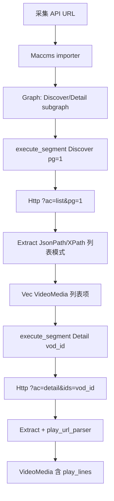
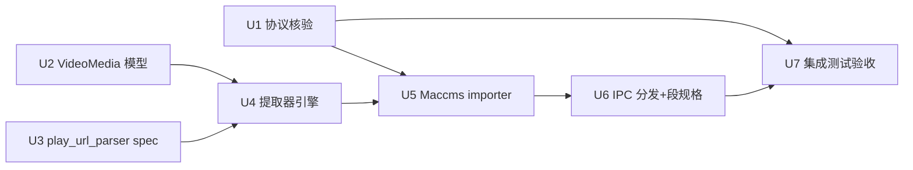

# Maccms 视频源首刀与提取器全格式 - Plan

> **2026-06-28 grilling 修订**：原 plan 含四块 stub（提取器全格式 / JS 宿主子集 / 控制流正填 / DAG 重写），经 `/grill-with-docs` 会话取证后收窄为两块（提取器全格式 + Maccms 视频源端到端）。JS 宿主子集与控制流/DAG 重写因首刀源无真实触发点移出（详见各节移出说明与 Scope Boundaries）。VideoMedia 字段形状从扁平 `chapters`+`play_from` 改为嵌套 `play_lines`（ADR-0027 修订）。`vod_play_url` 解析从 ExtractRule 改为 `ExtractSpec.play_url_parser` 结构化 spec（ADR-0028 附则）。Maccms 协议术语修正：`ac` 是 action（list/detail），`at` 是 format（json/xml）。

## Goal Capsule

- **目标**：从 Legado 图文书源单源首刀，横扩到 Maccms10 视频源一条具体源端到端贯通，并补齐提取器全格式（XPath/JSONPath 真实现）一块首刀 stub。
- **产品权威**：方向由 ADR-0001（tracer-bullet）、ADR-0003（自有 schema + 第三方 importer）、ADR-0005（媒体分层 enum）、ADR-0023/0025/0027/0028（图模型、分段、视频端点契约、字段级集合）锚定。
- **执行形态**：`code`，纯 Rust 后端 + 集成测试；前端 UI 本轮不动。
- **停步条件**：Phase A 集成测试 green bar（wiremock 回放红牛样本产出预期含 `play_lines` 的 `VideoMedia`）交付。

## Product Contract

### Summary

本轮把规则引擎从"Legado 书源线性链可跑"推进到"Maccms10 视频源线性链可跑 + 提取器全格式真实现"。单阶段交付：全格式提取器（R1-R4）+ Maccms importer（R8-R10）+ VideoMedia/play_lines 模型（R11-R12）+ Maccms 协议核验前置（R20）+ 集成测试验收（R13-R14），五块真耦合（共享 lj-node-extract / lj-importer / lj-core crate）。

原 plan 的 JS 宿主 API 子集（R5-R7）与控制流/DAG 整机重写（R15-R19）经取证移出：🌟Legado 首刀源靠 rquickjs 原生（var/Array/JSON）+ `{{page}}` 字符串替换已跑通 @js: 块，不触发 `java.ajaxGet`/宿主全局；红牛 Maccms 链路无 Js 节点；两条首刀源生成的都是线性链，零控制流节点、零 fan-out。两块都是"无真实触发源的能力投资"——JS 宿主子集是无真实 `java.ajaxGet` 调用源的安全门（合成 127.0.0.1 单测冒充防线有误导风险），控制流/DAG 是无分支源的重写（推倒工作的线性 executor 去支撑不存在的图）。各自 deferred 到有真实触发源时启动。

### Problem Frame

首刀（U1–U16）已全绿：10 crate workspace、Legado importer/compiler、HTTP/JS/Extract 三个 NodeProcessor、沙箱、SQLite 存储、4 个 Tauri IPC、前端导入/执行面板、wiremock 回放集成测试，`cargo test --workspace` 全通过。四类 stub 仍在，但 grilling 取证后按"首刀源是否真触发"分流：

- `lj-node-extract` 的 XPath/JSONPath 分支恒返 `UnsupportedFormat`（`processor.rs:104`），IR 层 `ExtractRule::XPath/JsonPath` 已定义但引擎未实现。**Maccms 链路真依赖**（红牛 XML/JSON 响应需 XPath/JsonPath 提取）→ 本轮补齐。
- `lj-node-js` 的 `host_api` 是空操作（`host_api.rs`），仅 `JSON.stringify(result)`。**首刀源不触发**：🌟源 @js: 块只用 rquickjs 原生 + `{{page}}` 模板替换（审计 2.7/3.1 节证实零 `java.*`），红牛 Maccms 无 Js 节点 → 移出。
- `executor.rs:261` 对 Merge/Condition/Loop 只 `warn`+`continue` 跳过。**首刀源不触发**：Legado/Maccms importer 均不 emit 控制流节点，`subroutines` 空表 → 移出。
- 视频源链路完全空白：`VideoMedia` 是 `{ title, url }` stub（`media.rs`），无 Maccms importer。**Maccms 链路真依赖** → 本轮补齐，且字段形状经 grilling 改为嵌套 `play_lines`（ADR-0027 修订）。

跨出新边界到视频源的代价是：Maccms10 不是规则文件格式（不像 Legado 书源 JSON），是 PHP 视频 CMS 的约定采集 API，导入入口是"采集 API 的 URL → LanJing 按协议推断 Graph"，与 Legado "书源 JSON → 翻译器" 并列成第二类第三方 importer（内置协议模板，无第三方文件格式）。

### Key Decisions

- **Maccms 导入入口为采集 API URL**：用户输入 Maccms 站点 API URL（`/api.php/provide/vod/`），LanJing 按 Maccms 协议推断生成 Graph。与旧 worktree 原型 `support::maccms::prepare(url)` 同形。否决"站点配置 JSON"与"直写本体节点图"：前者新增第三类第三方格式文件无社区分享生态，后者失去 importer 统一入口与预览中介步。
- **Maccms 协议术语（grilling 修正）**：`ac` 是 action（`list`|`detail`|`videolist`，importer 按端点固定：Discover/Search=list，Detail=detail），`at` 是 format（`json`|`xml`，importer 探测决定 Extract 用 JsonPath 还是 XPath）。原 plan 误写 `ac=json/xml`。列表参数 `t=<type_id>`/`pg=<N>`/`wd=<keyword>`/`pagesize=<N>`，详情参数 `ids=<vod_id>`。
- **VideoMedia 以播放线路为组织核心**：`play_lines: Vec<PlayLine>`，每条 `PlayLine { name, episodes: Vec<VideoEpisode> }` 保留线路↔分集绑定。否决扁平 `chapters: Vec<VideoChapter>` + `play_from: Vec<String>`（线路↔分集位置绑定丢失，前端无法重组）。详见 ADR-0027 修订记录。
- **`vod_play_url` 解析走 `ExtractSpec.play_url_parser`**：`ExtractRule` IR 四 variant 只产字符串/字符串列表，表达不出两级嵌套树。`ExtractSpec` 加可选 `play_url_parser: Option<PlayUrlParserSpec>`（含取值路径 + 各层分隔符 grammar），ExtractNodeProcessor 跑通用定界组装器产 `Vec<PlayLine>`。分隔符 grammar 是数据，由 importer 按源协议注入，lj-node-extract 不含 Maccms 专码。详见 ADR-0028 附则。
- **Discover Graph URL 带 `t={{type}}` 可选模板参数**：Http URL = `?ac=list&t={{type}}&pg={{pg}}`。首刀前端只填 `pg` 走全站最新流（红牛源真实可用），Graph 形态已为分类浏览就绪——未来前端加分类选择器调 `execute_segment { Discover, type=.., pg=.. }` 即可，无需改 Graph/模型/importer。分类导航 UI + `class` 元数据通道 deferred（`class` 被 Extract 的 `$.list[*]` 自然忽略，不引新 `NodeData` variant）。
- **EndpointKind 不扩**：视频源用 `Discover`/`Search`/`Detail` 三端点，Detail 一次性产含 `play_lines` 的 VideoMedia；ADR-0025 段边界在 IPC 层，视频源自然压成 2 段（discover/search → detail）而非书源 3 段，不需 `Toc`/`Content` 端点也不用新增 variant。
- **提取器兼容矩阵首刀**：`expected_type` 选解析器、`ExtractRule` variant 选查询语言，本轮做兼容组合（Html↔CssSelector+XPath+Regex、Xml↔XPath+Regex、Json↔JsonPath+Regex）。HTML+XPath 已纳入（xmloxide html5 解析器处理 HTML 非良构，与 Xml 共用 `evaluate_xpath` 求值逻辑，仅解析入口换为 `parse_html5`）。
- **JS 宿主子集移出（grilling）**：R5-R7 移出本 plan。🌟源零 `java.*`、红牛无 JS，首刀源不触发 `java.ajaxGet`/宿主全局。ADR-0029 决策保留（SSRF 硬底线、零 fs/env/process 注入、不做 host 同站约束），实现延后到有真实调用 `java.*` 的 Legado 源导入时启动。
- **控制流/DAG 重写移出（grilling）**：R15-R19 移出本 plan。两条首刀源生成的都是线性链，零控制流节点、零 fan-out。ADR-0022/0026 设计保留（ConditionBranch、Subroutine、Edge.condition_branch、stream-to-stream trait 已在 lj-core 落地），实现延后到有真实分支/循环/合并源触发。executor 线性 for-loop + stub-skip 保留。

### Requirements

**提取器全格式（Phase A）**

- R1. `lj-node-extract` 按节点 spec 的 `expected_type` 真实分发到 CSS 选择器（Html→scraper）、XPath（Html+Xml→xmloxide，Html 走 html5 解析）、JSONPath（Json→jsonpath-rust）三类引擎。HTML 同时支持 CSS 与 XPath（`html_css.rs`+`html_xpath.rs`），不再对 XML/JSON 恒返 Error。
- R2. XPath 引擎支持 `ExtractType` 的 `Text`/`Attr`/`Html` 后缀语义，支持 `RegexClean` 后处理。
- R3. JSONPath 引擎支持从 `serde_json::Value` 提取单值与列表，支持 `RegexClean` 后处理。
- R4. 列表模式（`field_rules` 非空）按 `expected_type` 逐 item 逐字段提取，产出 `Vec<NodeData>`，对 XML/JSON 与 HTML 行为一致。

**Maccms importer（Phase A）**

- R8. 新增 Maccms10 importer（`lj-importer/src/maccms/`），实现 `Importer<Opts>` trait，输入采集 API URL（`/api.php/provide/vod/`），按协议探测 `at=json|xml`（format，决定 Extract 用 JsonPath/XPath），`ac` 按端点固定（Discover/Search=`list`，Detail=`detail`），产出标准 Graph（Discover/Detail endpoint subgraph，Http→Extract 链）。
- R9. 前端 IPC `import_rule_with_preview` 内部按规则格式分发：Legado JSON 走 Legado translator，Maccms URL 走 Maccms importer，本体节点图 JSON 直通。统一导入预览中介步（ADR-0021）。
- R10. Maccms Discover Graph 的 Http URL = `?ac=list&t={{type}}&pg={{page}}`，`type` 可选模板参数（首刀前端只填 `pg` 走最新流）。分页由前端按 ADR-0025 分段多次调 `execute_segment`，不在 Graph 内含段边界。

**VideoMedia 模型（Phase A）**

- R11. `VideoMedia` 扩展为 `title`/`cover_url`/`description`/`kind`/`remarks`/`vod_id` + `play_lines: Vec<PlayLine>`（每条 `PlayLine { name: String, episodes: Vec<VideoEpisode> }`，每 `VideoEpisode { title: String, url: String }`）。详见 ADR-0027 修订。
- R12. Detail 端点提取 `vod_play_url` + `vod_play_from` 后，经 `ExtractSpec.play_url_parser`（含取值路径 + 线路间/集间/名-URL 间/play_from 内分隔符 grammar）解析产 `Vec<PlayLine>`，聚合进单 `VideoMedia`。分隔符 grammar 由 Maccms importer 按协议注入。详见 ADR-0028 附则。

**集成测试验收（Phase A 门）**

- R13. `.integration-tests` 新增 wiremock 回放红牛样本（`.integration-tests/fixtures/hongniu_*.json/xml` + R20 采集的 detail 样本同入 fixtures/）：Maccms URL 导入 → Graph 执行 → 产出 `VideoMedia`，断言关键字段（title/cover/play_lines 含多线路多分集）。
- R14. 真源站 QA（`real_source_maccms.rs`）对红牛站点网络可达时跑通同一链路，网络不可达时 wiremock 回放 fallback，不阻断 CI。

**Maccms 协议核验（Phase A 前置）**

- R20. 重定位为"Maccms 协议核验"（grilling 修正）。核验红牛站真实采集协议——`ac`/`at`/`t`/`pg`/`ids`/`pagesize` 参数约定、list vs detail 响应字段差异、`vod_play_url` 真实结构与分隔符、`class` 元数据形态；**含打一次真实 detail 请求（`?ac=detail&ids=<vod_id>`）采集含 `vod_play_url` 的响应样本**（真源站不可达时手造符合 Maccms 协议文档的最小合成样本并标注）。产出 `.tmp/maccms-protocol-audit.md`（不进版本控制），gate R8（importer URL 构造）与 R12（play_url_parser 分隔符 grammar）。旧 Legado 选择器+JS 审计（`.tmp/star-source-audit.md`）归 Legado-JS-富化阶段输入，不在本轮 gate。

**已移出（grilling）**

- ~~R5-R7. JS 引擎宿主子集~~：移出，归"Legado JS 宿主富化"阶段，由真实调用 `java.*` 的 Legado 源触发。ADR-0029 决策保留。
- ~~R15-R19. 控制流与 DAG 重写~~：移出，归"复杂分支源"阶段，由真实 emit Merge/Condition/Loop 的源触发。ADR-0022/0026 设计保留，executor 线性 for-loop + stub-skip 保留。

### Key Flows

- F1. Maccms 视频源发现
  - **Trigger:** 用户在前端导入预览页输入红牛采集 API URL，确认导入。
  - **Actors:** Maccms importer, GraphExecutor, 前端（本轮不动，沿用现有执行面板）
  - **Steps:** IPC `import_rule_with_preview` 分发到 Maccms importer → 探测 `at=` format → 生成 Discover/Detail Graph → 落库预览；用户调 `execute_segment { Discover, pg=1 }` → Http `?ac=list&t={{type}}&pg=1`（type 未填，走全站最新流）→ Extract 按 `at` 选 JSONPath/XPath 提取 `$.list[*].vod_name/vod_pic` 等 → 产出 `Vec<NodeData::Media(Video{..})>`。
  - **Covered by:** R8, R9, R10, R13

- F2. Maccms 视频源详情
  - **Trigger:** 用户从发现列表选一视频。
  - **Actors:** GraphExecutor
  - **Steps:** `execute_segment { Detail, vod_id=.. }` → Http `?ac=detail&ids=..` → Extract 取 `vod_play_url`+`vod_play_from` → `play_url_parser` 按分隔符 grammar 解析多线路多分集 → 产出含 `play_lines: Vec<PlayLine>` 的 `VideoMedia`。
  - **Covered by:** R11, R12, R13

### Acceptance Examples

- AE1. XML 响应提取
  - **Covers:** R1, R2
  - **Given:** 一个 Extract 节点 spec `expected_type=Xml`，XPath 表达式 `/rss/list/video/name/text()`
  - **When:** 上游 HttpResponse 是红牛 XML 样本
  - **Then:** 产出多个 `NodeData::Media`，每个 title 取自 `<name>` CDATA，不再返 `UnsupportedFormat`。

- AE2. JSON 响应提取多字段 + play_lines 解析
  - **Covers:** R1, R3, R4, R11, R12
  - **Given:** Discover Extract 节点 `expected_type=Json`，`field_rules` 含 `name=$.list[*].vod_name`、`cover=$.list[*].vod_pic`；Detail Extract 节点带 `play_url_parser`（分隔符 grammar 据 R20 核验的红牛 `vod_play_url` 真实结构注入）
  - **When:** 上游是红牛 JSON 样本（Discover 列表 + R20 采集的 detail 样本）
  - **Then:** Discover 列表模式逐 item 提取产出 N 个 VideoMedia，每个 cover_url 取自 `vod_pic`；Detail 产出 1 个 VideoMedia 含 `play_lines`（红牛双线路 hnyun/hnm3u8 各自带分集，线路↔分集绑定保留）。

### Success Criteria

- 集成测试 `pnpm test:rs`（含新红牛 wiremock 回放 + detail 样本）green bar，是真源站 QA fallback 的双轨验收门（ADR 双轨原则）。
- `cargo clippy --workspace --all-targets --all-features -- -D warnings` 无 warning（clippy all+pedantic deny）。
- 公共 API 项 doc comment 覆盖（`missing_docs` pedantic lint）满足。
- 文件行数守卫：Rust ≤400 行，超出需拆分理由。

### Scope Boundaries

**Deferred for later**

- LXMusic 音源 importer（ADR-0003 第三类源，本轮横扩只到视频源第二类）。
- 前端视频源 UI 适配（用户明确本轮前端不动；VideoMedia 模型先到位，UI 后续接）。
- Maccms 分类导航 UI + `class` 元数据通道（Discover Graph 形态已就绪带 `t={{type}}`，前端分类选择器 + `class` 如何传前端待定，可能引 `NodeData::Meta` 或 Graph meta 机制）。
- Legado JS 宿主富化（原 R5-R7）：`baseUrl`/`book`/`source`/`cookie` 只读全局 + `java.encodeURI/decodeURI/log` + 经 SSRF 硬底线的 `java.ajaxGet/Post`。由真实调用 `java.*` 的 Legado 源触发，ADR-0029 决策保留。
- 控制流正填与 DAG 重写（原 R15-R19）：Merge/Condition/Loop processor + executor fan-out。由真实 emit 控制流节点的源触发，ADR-0022/0026 设计保留。
- 本体节点图 xyflow 可视化编辑器（ADR-0023 提及的未来）。

**Outside this product's identity**

- 全量复刻 Legado `BookSourceEvaluateRule` 宿主 API（ADR-0003 已否决"100% 兼容"，JS 子集限中间子集——即便富化阶段启动也不全量）。
- Maccms 站点配置 JSON 第三方文件格式（无社区分享生态，选内置 URL 协议模板）。
- Graph 内含段边界标记或执行暂停/恢复机制（ADR-0025 已否决，段边界在 IPC 层）。

### Dependencies / Assumptions

- D2. `xmloxide 0.4.3`、`jsonpath-rust 1.0.4`、`scraper 0.27.0` 已在 `Cargo.toml` `[workspace.dependencies]`，无需新增依赖。
- D3. Maccms 协议核验依赖红牛样本 + R20 真实 detail 请求观察的 `ac=list|detail`/`at=json|xml`/`t`/`pg`/`ids` 约定；不同 Maccms 站点可能有协议变体，本轮覆盖红牛一源，多站兼容留 Outstanding。

### Outstanding Questions

**Deferred to Planning**

- OQ2. Maccms 站点 `at` format 的探测策略 — **planning 已解决**（见 KTD2）：importer 导入预览阶段探测后静态写入 Graph `HttpSpec.expected_type`，运行执行不嗅探响应。
- OQ3. `vod_play_url` 多线路分隔解析的具体边界 — **planning 已解决**（见 KTD3）：分隔符 defaults 按 Maccms 协议约定（`line_sep=###`/`episode_sep=#`/`name_url_sep=$`/`play_from_sep=,`），可由 importer 按源协议覆盖，不匹配时 Extract 返 Error 提示而非静默吞。
- OQ5（grilling 新增）. Maccms 分类导航的 `class` 元数据通道设计（`NodeData::Meta` variant? Graph meta 节点? 前端读首次响应?），deferred 到分类导航 UI 阶段定。

### Sources / Research

- `.tmp/maccms10/说明文档/API接口说明.txt`、`API接口说明V2.txt` — Maccms10 协议文档（V1+V2），importer（R8）与 R20 协议核验的协议依据。
- `.tmp/hongniu_json.json`、`.tmp/hongniu_sample.xml`、`.tmp/hongniu_m3u8_json.json`、`.tmp/hongniu_*.xml` — 红牛资源站真实采集响应样本（列表响应，含 `vod_play_from:"hnyun,hnm3u8"` 双线路），wiremock 回放（R13）与字段映射（R11/R12）基准。**注意：现存样本无 `vod_play_url`（均为列表响应），detail 样本由 R20 采集补齐。**
- `.tmp/star-source-audit.md` — 🌟免费小说 Legado 书源审计（已存在），证明首刀 Legado 源零 `java.*`、纯 CSS，gate 出 R5-R6 应移出。归 Legado-JS-富化阶段输入。
- `src-tauri/crates/lj-importer/src/legado/translator.rs` — 现有 Legado translator 结构，Maccms importer（R8）的并列参照。
- `src-tauri/crates/lj-core/src/extract_rule.rs` — `ExtractRule::XPath/JsonPath` IR 已定义，提取器（R1–R4）只填引擎实现；`ExtractSpec` 加 `play_url_parser`（R12）的扩展基准。
- `src-tauri/crates/lj-core/src/media.rs` — `VideoMedia` 现状 stub，R11 扩展基准。
- `docs/adr/0021-import-entry-multi-with-preview.md` — 导入入口与预览中介步，R9 IPC 分发契约。
- `docs/adr/0025-execution-segmentation-frontend-controlled.md` — `execute_segment` 段边界在 IPC 层，R10 不破约束。
- `docs/adr/0027-video-source-detail-single-shot-endpoint-contract.md` — 视频端点契约，**2026-06-28 修订**：VideoMedia 字段形状改为嵌套 `play_lines: Vec<PlayLine>`，R11/R12 依据。
- `docs/adr/0028-extract-single-value-and-field-level-collection.md` — 字段级集合，**2026-06-28 附则**：嵌套结构字段级集合由 `ExtractSpec.play_url_parser` 驱动，R12 依据。
- `docs/adr/0029-js-host-api-injection-and-network-boundary.md` — JS 宿主 API 注入与网络边界，R5-R6（已移出）的决策依据，实现延后。
- `docs/solutions/integration-issues/legado-engine-full-chain-integration.md` — 全链集成经验，Maccms 集成（R13）参照。

---

## Planning Contract

> **Product Contract preservation**: Product Contract unchanged. OQ2/OQ3 在 planning 阶段解决（见 Key Technical Decisions KTD2/KTD3），OQ5 维持 deferred（分类导航 UI 阶段）。

### Summary

实现分七单元：协议核验前置 gate → `lj-core` 数据形状（VideoMedia 嵌套模型 + `ExtractSpec.play_url_parser` 分隔符 grammar）→ `lj-node-extract` 提取器 XML/JSON/HTML 引擎真实现替换 stub → `lj-importer` 新增 Maccms 模块 → IPC 分发与段规格扩 `vod_id` → `.integration-tests` wiremock 回放验收。提取器与 importer 共享 `lj-core` 新模型，五块真耦合。

### Key Technical Decisions

- KTD1. **视频详情段传 `vod_id` 扩 `SegmentSpec`（非复用 `book_url`）**：`SegmentSpec` 加 `vod_id: Option<String>` 字段。复用 `book_url` 语义混用（视频无书页概念），扩字段干净但改 ADR-0025 契约结构。取扩字段，契约改动记入 ADR-0025 修订记录。
- KTD2. **Maccms `at` format 静态设不嗅探（OQ2 解决）**：Graph 是静态模型，`HttpSpec.expected_type` 导入时定，决定 Extract 用 JsonPath/XPath。运行时嗅探响应 `Content-Type` 违反静态模型且引入双路径。importer **不打探测请求**（`Importer::import` 是 sync 且 `lj-importer` crate 无 HTTP 能力，引入探测会新增 SSRF 路径），改为默认 `at=json`（红牛源默认）+ 用户导入时可选 format 参数，定后写入 Graph 静态字段，运行执行不嗅探。
- KTD3. **`play_url_parser` 分隔符 grammar defaults 按 Maccms 协议约定（OQ3 解决）**：Maccms `vod_play_url` 标准格式 `<线路1集1名$url1#集2名$url2#...###线路2集1名$url1#...`，`vod_play_from` 以 `,` 分隔线路名。defaults：`line_sep="###"`、`episode_sep="#"`、`name_url_sep="$"`、`play_from_sep=","`。容错：分隔符可由 importer 按源协议覆盖，defaults 不匹配时 Extract 返 Error 提示分隔符不匹配（不静默吞）。
- KTD4. **importer `field_rules` 按 `at` format 分别生成**：JSON 响应字段名 `vod_name`/`vod_pic`/`vod_id`/`vod_play_from`/`vod_play_url`/`vod_remarks`，XML 响应字段名 `name`/`pic`/`id`/`dt`/`note`（样本核验：XML 用 `<name>`/`<id>`/`<dt>` 而非 `vod_name`）。同一 Graph 按 `expected_type` 生成对应 `field_rules`，不混用。
- KTD5. **提取器新增 `xml.rs`/`json.rs`/`html_xpath.rs`/`html_css.rs` 模块**：`lj-node-extract/src/` 新增 `xml.rs`（xmloxide XPath）、`json.rs`（jsonpath-rust JSONPath）、`html_xpath.rs`（xmloxide html5 解析 + XPath，处理 `ExpectedDataType::Html` + `ExtractRule::XPath` 组合）、`html_css.rs`（从 `html.rs` 拆出的 scraper CSS 逻辑），`processor.rs` 的 `Xml|Json` dispatch stub 替换为真实分发，Html 路径扩为 CSS+XPath 双引擎。xmloxide 本支持 html5 解析，HTML+XPath 无新依赖（D2 的 `xmloxide 0.4.3` 覆盖），无 Windows MSVC 风险。列表模式对 XML/JSON/HTML 按 `field_rules` 逐 item 逐字段提取，复用统一 `field_rules` 消费逻辑形状。

### High-Level Technical Design

数据流（Maccms URL → Graph → 执行 → VideoMedia）：



`play_url_parser` 分隔符 grammar（directional guidance，非实现规范）：

```text
PlayUrlParserSpec {
  value_path:     到 vod_play_url 字符串的取值路径
  line_sep:        线路间分隔符   (default "###")
  episode_sep:     集间分隔符     (default "#")
  name_url_sep:    名-URL 分隔符 (default "$")
  play_from_sep:   vod_play_from 内线路名分隔符 (default ",")
}
解析: split(vod_play_url, line_sep)    → N 线路
      每线路 split(episode_sep)       → M 集
      每集 split(name_url_sep)        → (title, url)
      split(vod_play_from, play_from_sep) → N 线路名按序绑定
```

### Sequencing

依赖序：



- U1 协议核验：可并行启（调研型，产出 `.tmp` 不阻塞代码），gate U5 分隔符 grammar 与 URL 构造，gate U7 detail 样本
- U2/U3 并行：`lj-core` 模型与 spec 无相互依赖（U3 `PlayUrlParserSpec` 为纯字符串数据），U4 是 join 点依赖 U2+U3
- U5 依赖 U1（audit gate）+ U2 + U3 + U4
- U6 依赖 U5
- U7 依赖 U2-U6 全链 + U1 detail 样本

## Implementation Units

### U1. Maccms 协议核验

- **Goal:** 核验红牛站真实采集协议，产出协议核验文档与 detail 样本，gate importer URL 构造与 `play_url_parser` 分隔符
- **Requirements:** R20
- **Dependencies:** 无（前置）
- **Files:** `.tmp/maccms-protocol-audit.md`（新建，不进版本控制）, `.integration-tests/fixtures/hongniu_detail_*.json`/`.xml`（detail 样本，本地保留，整体不入版本库，供 U7 wiremock 回放）
- **Approach:** 读 `.tmp/maccms10/` 协议文档 + 现有列表样本字段对照；对红牛采集 API 打一次真实 detail 请求 `?ac=detail&ids=<vod_id>` 采集含 `vod_play_url` 的响应样本；真源站不可达时手造符合 Maccms 协议文档的最小合成样本并标注。核验 `ac`/`at`/`t`/`pg`/`ids`/`pagesize` 参数约定、list vs detail 响应字段差异、`vod_play_url` 真实结构与分隔符、`class` 元数据形态。产出 `.tmp/maccms-protocol-audit.md`；detail 样本落 `.integration-tests/fixtures/hongniu_detail_*.{json,xml}`（本地保留，整体不入版本库）供 U7 wiremock 回放。
- **Patterns to follow:** `.tmp/star-source-audit.md` 既有审计格式
- **Test scenarios:** Test expectation: none -- 产出为协议核验文档与 detail 样本，gate U5 分隔符 grammar 与 URL 构造，非行为代码
- **Verification:** `.tmp/maccms-protocol-audit.md` 存在且含 `vod_play_url` 真实结构记录 + 分隔符确认；detail 样本文件落 `.integration-tests/fixtures/`（本地保留，整体不入版本库；真实采集或合成标注）

### U2. VideoMedia 嵌套模型

- **Goal:** `VideoMedia` 扩展为含 `play_lines` 嵌套结构的完整视频媒体模型
- **Requirements:** R11
- **Dependencies:** 无
- **Files:** `src-tauri/crates/lj-core/src/media.rs`（修改）
- **Approach:** `VideoMedia` 扩展字段 `title`/`cover_url`/`description`/`kind`/`remarks`/`vod_id` + `play_lines: Vec<PlayLine>`，新增 `PlayLine { name: String, episodes: Vec<VideoEpisode> }` 与 `VideoEpisode { title: String, url: String }`。移除旧 `url: Option<String>`（`play_lines` 取代）。`derive Debug/Clone/PartialEq/Eq/Serialize/Deserialize` 与现有一致。
- **Patterns to follow:** `src-tauri/crates/lj-core/src/media.rs` 现有 `BookMedia`/`BookChapter` 嵌套结构
- **Test scenarios:**
  - Happy path: 构造含 2 线路各 3 分集的 `VideoMedia`，断言 `play_lines.len()==2` 且每条 `episodes.len()==3`
  - Edge cases: 空 `play_lines` 的 `VideoMedia` 合法构造
- **Verification:** `cargo test --manifest-path src-tauri/Cargo.toml -p lj-core` 通过；`VideoMedia`/`PlayLine`/`VideoEpisode` 公共项有 doc comment

### U3. ExtractSpec.play_url_parser 分隔符 grammar

- **Goal:** `ExtractSpec` 加可选 `play_url_parser` spec，定义两级嵌套树解析的分隔符 grammar
- **Requirements:** R12
- **Dependencies:** 无（`PlayUrlParserSpec` 为纯字符串数据；`PlayLine` 形状由 U4 消费）
- **Files:** `src-tauri/crates/lj-core/src/extract_rule.rs`（修改）
- **Approach:** 新增 `PlayUrlParserSpec` struct（`value_path: String`/`line_sep: String`/`episode_sep: String`/`name_url_sep: String`/`play_from_sep: String`），`ExtractSpec` 加 `play_url_parser: Option<PlayUrlParserSpec>` 字段（`serde default None`）。spec 是数据，不含 Maccms 专码，分隔符由 importer 按源协议注入。
- **Patterns to follow:** `src-tauri/crates/lj-core/src/extract_rule.rs` 现有 `ExtractSpec`/`ExtractRule` serde 模式
- **Test scenarios:**
  - Happy path: 构造 `PlayUrlParserSpec` 含 defaults，断言分隔符字段值
  - Edge cases: `ExtractSpec` 默认 `play_url_parser` 为 `None`
- **Verification:** `cargo test -p lj-core` 通过；`PlayUrlParserSpec` 公共项有 doc comment

### U4. 提取器 XML/JSON/HTML 全格式引擎

- **Goal:** `lj-node-extract` 按 `expected_type` 真实分发到 XPath/JSONPath/CSS 引擎，替换 stub，支持列表模式与 `play_url_parser` 解析
- **Requirements:** R1, R2, R3, R4, R12
- **Dependencies:** U2（`VideoMedia` 形状）, U3（`play_url_parser` spec）
- **Files:** `src-tauri/crates/lj-node-extract/src/processor.rs`（修改 dispatch）, `src-tauri/crates/lj-node-extract/src/xml.rs`（修改）, `src-tauri/crates/lj-node-extract/src/json.rs`（修改）, `src-tauri/crates/lj-node-extract/src/html_xpath.rs`（新建）, `src-tauri/crates/lj-node-extract/src/html_css.rs`（新建）, `src-tauri/crates/lj-node-extract/src/lib.rs`（mod 声明）, `src-tauri/crates/lj-node-extract/tests/html_xpath_test.rs`（新建）
- **Approach:** `processor.rs` 的 `Xml|Json` stub 分支替换为调用 `xml::extract`/`json::extract`。`xml.rs` 用 xmloxide 解析 XML，按 XPath 表达式 + `ExtractType`（Text/Attr/Html）提取，支持 `RegexClean` 后处理。`json.rs` 用 jsonpath-rust 从 `serde_json::Value` 提取单值与列表，支持 `RegexClean`。列表模式（`field_rules` 非空）按 `expected_type` 逐 item 逐字段提取产 `Vec<NodeData::Media(Media::Video(..))>`，对 XML/JSON 与 HTML 行为一致。Detail 端点带 `play_url_parser` 时，Extract 取 `vod_play_url`+`vod_play_from` 字符串，按分隔符 grammar 解析产 `Vec<PlayLine>` 聚合进单 `VideoMedia`。xmloxide/jsonpath-rust 配置 DTD/外部实体处理禁用 + 递归/深度上限（XXE 与 entity expansion 防护，响应来自用户指向的第三方 Maccms 站点，跨信任边界）。
- **Execution note:** 先写 XML/JSON 单值提取 failing test（Covers AE1 — XML XPath 取 `<name>` CDATA），再实现引擎；列表模式与 `play_url_parser` 解析随后补
- **Patterns to follow:** `src-tauri/crates/lj-node-extract/src/processor.rs` 现有 `extract_list`/`extract_single`/`try_extract_on_doc` 结构与 `RegexCache` 模式
- **Test scenarios:**
  - Covers AE1. XML 响应提取: `expected_type=Xml`，XPath `/rss/list/video/name/text()`，上游红牛 XML 样本 → 产多个 `NodeData::Media`，title 取自 `<name>` CDATA，不返 `UnsupportedFormat`
  - Covers AE2. JSON 响应提取多字段: `expected_type=Json`，`field_rules` 含 `name=$.list[*].vod_name`/`cover=$.list[*].vod_pic`，上游红牛 JSON 列表样本 → 逐 item 提取产 N `VideoMedia`，`cover_url` 取自 `vod_pic`
  - Edge cases: 空响应/无匹配 XPath/JSONPath 返 `NoMatch` 不 panic；`RegexClean` 后处理对 XML/JSON 生效
  - Error paths: 无效 XPath/JSONPath 表达式返 `ExtractError` 不 panic；`play_url_parser` 分隔符不匹配返 Error 提示
  - Integration: Detail 端点带 `play_url_parser`，上游含 `vod_play_url`+`vod_play_from` 样本 → 产 1 `VideoMedia` 含 `play_lines`（双线路各带分集，线路↔分集绑定保留）
- **Verification:** `cargo test -p lj-node-extract` 通过；clippy all+pedantic `-D warnings` 无 warning；`processor.rs` 与新模块各 ≤400 行

### U5. Maccms importer

- **Goal:** 新增 Maccms10 importer，输入采集 API URL，按协议推断生成标准 Graph
- **Requirements:** R8, R10, R12（R12 的 importer 注入半边：Detail Extract 注入 `play_url_parser` 分隔符 grammar）
- **Dependencies:** U1（audit gate 分隔符与 URL）, U2（`VideoMedia`）, U3（`play_url_parser` spec）, U4（Extract 消费 `play_url_parser`）
- **Files:** `src-tauri/crates/lj-importer/src/maccms/mod.rs`（新建）, `src-tauri/crates/lj-importer/src/maccms/translator.rs`（新建）, `src-tauri/crates/lj-importer/src/maccms/types.rs`（新建）, `src-tauri/crates/lj-importer/src/lib.rs`（mod 声明）
- **Approach:** `impl Importer<MaccmsSourceUrl> for MaccmsImporter`。输入采集 API URL（`/api.php/provide/vod/`），`at` format 默认 `json`（红牛源）+ 用户可选 format 参数（KTD2，不打探测请求），定后写入 Graph 静态字段。`ac` 按端点固定：Discover/Search=`list`，Detail=`detail`。产 Discover/Detail endpoint subgraph：Http→Extract 链。Discover Http URL = `{base}?ac=list&t={{type}}&pg={{pg}}`，Detail Http URL = `{base}?ac=detail&ids={{vod_id}}`。`field_rules` 按 `at` format 分别生成（KTD4）。Detail Extract 注入 `play_url_parser`（分隔符 defaults 据 KTD3，R12 importer 注入半边）。`validate_graph` 校验。
- **Execution note:** 先写 importer 产 Graph 结构断言 failing test，再实现 translator
- **Patterns to follow:** `src-tauri/crates/lj-importer/src/legado/mod.rs` + `translator.rs` 的 `Importer` impl 与 `EndpointState`/`build_http_extract_pair` 结构
- **Test scenarios:**
  - Happy path: Maccms URL 导入产 Graph，断言含 Discover Http+Extract 节点对、Detail Http+Extract 节点对、端点间边；Discover Http URL 含 `ac=list&t={{type}}&pg={{pg}}`，Detail Http URL 含 `ac=detail&ids={{vod_id}}`
  - Edge cases: `at=json` 与 `at=xml` 两种 format 各产对应 `expected_type` 的 Extract spec，`field_rules` 字段名按 format 不同
  - Error paths: 无效 URL（非 Maccms 采集 API 路径）返 `CoreError::Import`；`validate_graph` 失败返错
  - Integration: importer 产 Graph 经 `validate_graph` 通过，Detail Extract spec 含 `play_url_parser` 分隔符 defaults
- **Verification:** `cargo test -p lj-importer` 通过；clippy 无 warning；各文件 ≤400 行

### U6. IPC 分发与段规格扩展

- **Goal:** `import_rule_with_preview` IPC 按规则格式分发到三类 importer；`SegmentSpec` 扩 `vod_id` 字段支持视频详情段
- **Requirements:** R9
- **Dependencies:** U5（Maccms importer）
- **Files:** `src-tauri/src/commands/`（`import_rule_with_preview` 所在 IPC 文件）, `src-tauri/crates/lj-core/src/traits.rs`（`SegmentSpec` 扩 `vod_id`）, `docs/adr/0025-execution-segmentation-frontend-controlled.md`（修订记录）
- **Approach:** `import_rule_with_preview` 按输入类型分发：Legado JSON → Legado translator，Maccms URL（含 `/api.php/provide/vod/` 或 Maccms 协议特征）→ Maccms importer，本体节点图 JSON → 直通。`SegmentSpec` 加 `vod_id: Option<String>` 字段（KTD1），`execute_segment { Detail, vod_id=.. }` 传 `vod_id` 到 Http URL 模板渲染。ADR-0025 加修订记录注 `vod_id` 扩展。
- **Patterns to follow:** 现有 `import_rule_with_preview` IPC 结构（Legado 分支已有）
- **Test scenarios:**
  - Happy path: Maccms URL 输入分发到 Maccms importer 产 Graph 预览；Legado JSON 输入分发到 Legado importer；本体节点图 JSON 直通
  - Edge cases: `SegmentSpec` 含 `vod_id` 时 Detail 段 URL 模板渲染 `ids={{vod_id}}`；`vod_id=None` 时 Detail 段不渲染或返错
  - Error paths: 无法识别的输入格式返错
  - Integration: `execute_segment { Detail, vod_id }` 全链到 Http → Extract → `VideoMedia`
- **Verification:** `cargo test -p lj-core` + 相关 Tauri command 测试通过；ADR-0025 修订记录已加

### U7. 集成测试验收

- **Goal:** wiremock 回放红牛 Maccms 样本端到端贯通，断言 `VideoMedia` 含 `play_lines`；真源站 QA 双轨
- **Requirements:** R13, R14
- **Dependencies:** U1（detail 样本）, U2, U3, U4, U5, U6（全链）
- **Files:** `.integration-tests/tests/maccms_json.rs`（新建，红牛 JSON wiremock 回放）, `.integration-tests/tests/maccms_xml.rs`（新建，红牛 XML wiremock 回放）, `.integration-tests/tests/legado_wiremock.rs`（既有 Legado wiremock 回放）, `.integration-tests/tests/real_source_maccms.rs`（新建，红牛 Maccms 真源站 QA）, `.integration-tests/tests/real_source_legado.rs`（既有 Legado 真源站 QA）
- **Approach:** `maccms_json.rs`/`maccms_xml.rs` 加红牛 Maccms 回放：Mock 采集 API list 与 detail 端点返回 `.integration-tests/fixtures/hongniu_*.json`/`.xml`（含 U1 detail 样本）；Maccms URL 导入 → Graph 执行 `execute_segment { Discover, pg=1 }` → 断言 `Vec<VideoMedia>` 关键字段；`execute_segment { Detail, vod_id }` → 断言单 `VideoMedia` 含 `play_lines`（红牛双线路 hnyun/hnm3u8 各自带分集）。`real_source_maccms.rs` 加红牛 Maccms QA，网络可达时跑同一链路，不可达时 wiremock fallback 不阻断 CI。
- **Execution note:** 先写 wiremock 回放 failing test（断言 `play_lines` 含双线路多分集），再驱动 U2-U6 实现
- **Patterns to follow:** `.integration-tests/tests/legado_wiremock.rs` 现有 Legado wiremock 回放结构
- **Test scenarios:**
  - Covers F1. Maccms 视频源发现: wiremock 回放红牛列表样本，Maccms URL 导入 → `execute_segment` Discover → 产 `Vec<VideoMedia>` 列表项含 title/cover_url
  - Covers F2. Maccms 视频源详情: wiremock 回放红牛 detail 样本，`execute_segment` Detail → 产 1 `VideoMedia` 含 `play_lines`，断言 hnyun/hnm3u8 双线路各带分集，线路↔分集绑定保留
  - Edge cases: 空列表响应产空 `Vec` 不 panic；detail 样本无 `vod_play_url` 时返 Error 不伪造 `play_lines`
  - Integration: 全链 Maccms URL → importer → Graph → `execute_segment` → Http(wiremock) → Extract → `VideoMedia`，无 mock 隔断 Extract/importer 层
  - real_source_maccms: 网络可达时跑红牛真源站同链路；不可达时 fallback wiremock 不阻断 CI
- **Verification:** `pnpm test:rs`（含新红牛 wiremock 回放 + detail 样本）green bar，是真源站 QA fallback 的双轨验收门

## Verification Contract

| 命令                                                                 | 用途                                            | 适用单元   |
| -------------------------------------------------------------------- | ----------------------------------------------- | ---------- |
| `cargo test --manifest-path src-tauri/Cargo.toml -p lj-core`         | 核心模型与 trait 测试                           | U2, U3, U6 |
| `cargo test --manifest-path src-tauri/Cargo.toml -p lj-node-extract` | 提取器引擎测试                                  | U4         |
| `cargo test --manifest-path src-tauri/Cargo.toml -p lj-importer`     | importer 测试                                   | U5         |
| `cargo test --manifest-path .integration-tests/Cargo.toml`           | 集成测试                                        | U7         |
| `pnpm test:rs`                                                       | workspace 全测试（含集成），双轨验收门          | 全         |
| `pnpm lint:rs`                                                       | clippy all+pedantic `-D warnings`               | 全         |
| `pnpm check`                                                         | 前端 lint+typecheck+format 守卫（本轮前端不动） | 全         |
| 文件行数守卫                                                         | Rust ≤400 行/文件，超出需拆分理由               | 全         |

## Definition of Done

**全局：**

- `pnpm test:rs` green bar（含新红牛 wiremock 回放 + detail 样本）
- `pnpm lint:rs` 无 warning（clippy all+pedantic deny）
- 公共 API 项 doc comment 覆盖（`missing_docs` pedantic lint）
- Rust 文件 ≤400 行，超出需拆分理由
- ADR-0025 修订记录已加（`vod_id` 扩展，KTD1）
- `.tmp/maccms-protocol-audit.md` 产出（不进版本控制，gate 已满足）
- 红牛 list + detail 样本落 `.integration-tests/fixtures/`（本地保留，整体不入版本库；CI 与新克隆需本地重建）
- 清理：无废弃尝试代码残留于 diff

### Risks

- **SSRF**：用户输入采集 API URL → outbound fetch。Mitigation：Http 节点走 `lj-node-http` 的 SSRF 硬底线（ADR-0029，`validate_url_and_pin` + IP-pinning）；importer 不打探测请求（KTD2），消除导入预览阶段 SSRF 路径。
- **XML/JSON 解析攻击**：响应来自第三方 Maccms 站点，跨信任边界。Mitigation：U4 配置 xmloxide/jsonpath-rust 禁用 DTD/外部实体 + 递归/深度上限（XXE 与 entity expansion 防护）。
- **样本信任**：wiremock 回放样本是固定 fixture，不引入运行时网络风险；real_source_maccms 真源站 QA 走同一 SSRF 硬底线。

**Per-unit：** 各单元 `Verification` 字段满足 + 对应 `cargo test -p <crate>` 通过。
