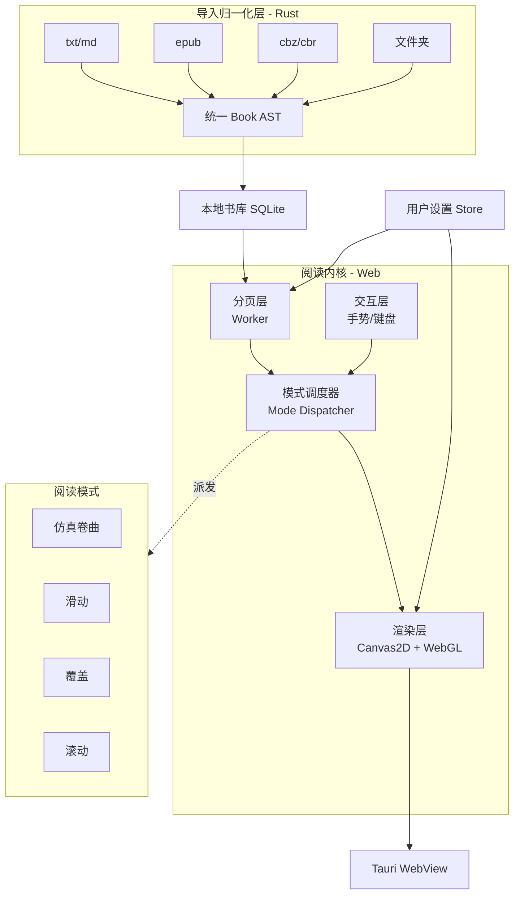

# 跨平台阅读器架构设计文档

| 项 | 值 |
|----|----|
| 版本 | v0.1 |
| 日期 | 2026-07-27 |
| 状态 | 设计中 |
| 技术栈 | Tauri 2.0 · Pretext · WebGL/Canvas · Rust |

## 1. 目标与范围

### 目标
自研一款**真仿真 + 全模式**的跨平台阅读器，支持小说与漫画，统一数据格式，可深度定制排版。

### 功能范围
- **内容类型**：小说（文本）、漫画（图片）、Webtoon（竖长图）
- **阅读模式**：仿真翻页（卷曲）、滑动翻页、覆盖翻页、连续滚动、（可选）淡入淡出
- **排版定制**：字体、字号、行高、字距、颜色、背景、页边距、段距、首行缩进
- **平台**：Windows / macOS / Linux / iOS / Android （一套 Web 代码 + Tauri 壳）

### 非目标
- 不做内容创作/编辑
- 不做云端书城（仅本地书库 + 可选云同步）

---

## 2. 整体架构



**核心抽象**：导入层把一切内容归一化为统一 **Book AST**；分页层把 AST 切成 **Page 列表**；**Mode Dispatcher** 接收同一份 Page 列表，按当前模式派发给对应的渲染器。**模式之间共享 Page 数据，只切换渲染与交互**——这是支持"所有模式都做"的关键。

---

## 3. 数据归一化：统一 Book AST

所有来源转成**同一种**中间格式，下游只认它。

### 3.1 AST 定义

```ts
type Book = {
  id: string
  meta: BookMeta                 // 标题/作者/封面/语言/方向
  kind: 'novel' | 'comic' | 'webtoon'
  spine: Chapter[]               // 章节顺序
  assets: AssetIndex             // 图片资源索引（按需加载）
}

type BookMeta = {
  title: string; author?: string
  cover?: AssetRef; language: string
  direction: 'ltr' | 'rtl'       // 阅读方向（日漫 rtl）
  sourceFormat: 'txt'|'epub'|'cbz'|'folder'|'md'
}

type Chapter = {
  id: string
  title?: string
  blocks: Block[]                // 内容块序列
}

type Block =
  | { type: 'heading'; level: 1|2|3; text: string; id: string }
  | { type: 'text'; runs: TextRun[]; paraStyle?: ParaStyle }
  | { type: 'image'; ref: AssetRef; w: number; h: number; alt?: string; spread?: 'auto'|'single'|'double' }
  | { type: 'rule' }             // 分隔线

type TextRun = { text: string; style?: InlineStyle }   // 支持粗体/斜体/注音

type AssetRef = string                            // assets 索引键
type AssetIndex = Map<AssetRef, { mime: string; loader: () => Promise<Blob> }>
```

### 3.2 Importer 矩阵（Rust 实现）

| 来源 | 解析 | AST 形态 | 注意点 |
|------|------|---------|--------|
| `txt` | 按章节正则/空行切 | `kind:'novel'`，纯 `text` 块 | 编码检测（UTF-8/GBK） |
| `epub` | OPF spine + XHTML + 资源 | `kind:'novel'`（图少）或 `'comic'` | 保留 CSS 等价语义→ParaStyle |
| `cbz`/`cbr`/`zip` | 解压 + 图片排序 | `kind:'comic'`，纯 `image` 块 | 自然排序（`img2` < `img10`） |
| 文件夹 | 扫描图片 | 同 cbz | 同上 |
| `md` | mdast 解析 | `kind:'novel'`，含 `heading` | 代码块/链接映射 |

### 3.3 漫画特有处理
- **跨页检测**：图宽高比 > 1.4 标记 `spread:'double'`，渲染时占满双页栈
- **Webtoon 判定**：连续窄长图（宽高比 < 0.7 且数量多）→ `kind:'webtoon'`，强制滚动模式

---

## 4. 分页层（Web Worker，Pretext 驱动）

分页在 Worker 跑，主线程零阻塞。Pretext 提供跨端一致的文本测量。

### 4.1 小说分页（Pretext）

```ts
// paginate.worker.ts
import { layout } from '@chenglou/pretext'   // API 形式需对照其文档

self.onmessage = ({ data }) => {
  const { chapter, settings, pageSize } = data
  const pages: Page[] = []
  let cur: Block[] = [], curH = 0

  for (const block of chapter.blocks) {
    if (block.type === 'text') {
      const lines = layout(block.runs, textSettings(block, settings), pageSize.contentW)
      for (const line of lines) {
        if (curH + line.height > pageSize.contentH) { pages.push(commit(cur)); cur = []; curH = 0 }
        cur.push({ type:'line', line }); curH += line.height
      }
    } else if (block.type === 'image') {
      const h = scaleToFit(block, pageSize)
      if (curH + h > pageSize.contentH) { pages.push(commit(cur)); cur = []; curH = 0 }
      cur.push({ type:'image', block, h }); curH += h + gap
    }
    // heading/rule 类似
  }
  self.postMessage({ pages, chapterId: chapter.id })
}
```

- 改字体/行高 → 整本重排在 Worker 几十毫秒完成，主线程无感
- **位置锚点**：进度存 `{chapterId, blockIdx, charOffset}`，重排后用锚点还原页码

### 4.2 漫画/Webtoon 分页
- **漫画**：一图一页（跨页图占双页宽度），**不走 Pretext**
- **Webtoon**：不分页，所有图垂直拼接成一条"长卷"，滚动消费

---

## 5. 阅读模式矩阵（核心）

同一份 Page 列表，5 种模式各有渲染器与交互。模式可运行时切换。

### 5.1 模式 × 内容类型 支持矩阵

| 模式 | 小说 | 漫画 | Webtoon |
|------|:----:|:----:|:-------:|
| 仿真翻页（卷曲） | ✓ | ✓ | ✗ |
| 滑动翻页 | ✓ | ✓ | ✗ |
| 覆盖翻页 | ✓ | ✓ | ✗ |
| 连续滚动 | ✓ | ✓ | ✓（强制） |
| 淡入淡出（可选） | ✓ | ✓ | ✗ |

> Webtoon 本质是连续滚动，强制走滚动模式；其他模式对其禁用。

### 5.2 各模式实现

#### 模式 A：仿真翻页（WebGL 顶点着色器）
- **渲染**：每页 `ImageBitmap` → WebGL 纹理；顶点着色器做 harism 风格圆柱卷曲（`uProgress` 0→1，`uBend` 弧度）
- **结构**：双页栈（书脊两侧）或单页栈；每张纸 front/back 两面共享 uniform
- **交互**：拖拽直接驱动 `uProgress`；松手按速度完成/回弹
- **坑**：raycaster 命中不到弯曲几何 → 用屏幕半区判方向

#### 模式 B：滑动翻页（CSS scroll-snap / transform）
- **渲染**：每页一个 DOM/Canvas，横向排列，`scroll-snap-type: x mandatory`
- **交互**：原生横向滑动，`scroll-snap` 自动对齐
- **性能**：最轻量，Canvas 2D 即可，**不需要 WebGL**
- **适用**：低性能设备或用户偏好快速翻阅

#### 模式 C：覆盖翻页（z-index 堆叠）
- **渲染**：页栈 `position:absolute` 堆叠，当前页顶层
- **交互**：翻页时新页从一侧（`translateX`）滑入盖住旧页，旧页轻微缩放/暗化
- **实现**：CSS `transform` + `transition`，**不需要 WebGL**

#### 模式 D：连续滚动（垂直）
- **小说**：Pretext 输出全部行，渲染成一条长卷（虚拟滚动，仅渲染视口 ±缓冲区）
- **漫画/Webtoon**：图片垂直拼接，`IntersectionObserver` 懒加载
- **交互**：原生垂直滚动 + 翻页键跳到下屏
- **关键**：虚拟化（仅渲染可见 ±2 屏），否则长书卡死

#### 模式 E：淡入淡出（可选）
- 两页 `opacity` 交叉过渡，适合幻灯片式展示

### 5.3 Mode Dispatcher（模式切换核心）

```ts
type ReadMode = 'curl' | 'slide' | 'cover' | 'scroll' | 'fade'

interface PageRenderer {
  mount(container: HTMLElement, pages: PageStream): void
  goTo(anchor: Anchor): void
  setSettings(s: ReaderSettings): void
  destroy(): void
}

const renderers: Record<ReadMode, () => PageRenderer> = {
  curl:   () => new CurlRenderer(),      // WebGL
  slide:  () => new SlideRenderer(),     // scroll-snap + Canvas
  cover:  () => new CoverRenderer(),     // transform 堆叠
  scroll: () => new ScrollRenderer(),    // 虚拟滚动
  fade:   () => new FadeRenderer(),
}

function switchMode(mode: ReadMode) {
  current?.destroy()
  current = renderers[mode]()
  current.mount(container, pageStream)
  current.goTo(currentAnchor)   // 切模式不丢位置
}
```

**所有 Renderer 消费同一份 `PageStream`**，切换模式时位置不丢。

---

## 6. 渲染层分工

| 内容/模式 | 仿真卷曲 | 滑动/覆盖/淡入 | 滚动 |
|----------|---------|---------------|------|
| 小说页 | WebGL（纹理由 Canvas2D 离屏生成） | DOM 文本 或 Canvas2D | DOM + 虚拟滚动 |
| 漫画页 | WebGL（图片直接当纹理） | `` / Canvas2D | `` + 懒加载 |
| Webtoon | — | — | `` 垂直拼接 |

> 能用 DOM/CSS 的模式（滑动/覆盖/滚动）**不强行上 WebGL**——只有仿真卷曲必须 WebGL。这是性能与复杂度的平衡。

---

## 7. 卷曲着色器（仿真模式专享）

```glsl
// vertex shader（via material onBeforeCompile 等价物）
uniform float uProgress;   // 0..1 翻转进度
uniform float uBend;       // 卷曲弧度
void main() {
  vec3 p = position;
  float a = uProgress * 3.14159;
  p.xz = mat2(cos(a),-sin(a),sin(a),cos(a)) * p.xz;  // 绕书脊 y 轴
  p.y += sin(p.x * 3.14159) * uBend * sin(uProgress * 3.14159); // 卷曲鼓起
  gl_Position = projection * view * model * vec4(p, 1.0);
}
```

阴影：卷曲背后画一层 alpha 渐变软阴影网格（廉价 trick）。背面纹理 U 翻转。

---

## 8. 用户设置系统

```ts
type ReaderSettings = {
  fontFamily: string; fontSize: number; lineHeight: number
  letterSpacing: number; paragraphSpacing: number; indent: number
  color: string; background: string | Gradient | TextureRef
  margin: { top; right; bottom; left }
  mode: ReadMode; pageLayout: 'single'|'double'|'auto'
  direction: 'ltr'|'rtl'
}
```

- 改任一项 → Worker 重排（debounce 300ms）→ 重新生成可见页纹理
- 设置持久化：**Tauri Store**（本地）+ 可选云同步
- 字体：内置 2-3 套 + 用户导入；中文字体用 `cn-font-split` 按章节子集化

---

## 9. 跨平台（Tauri 2.0）

| 平台 | WebView | 备注 |
|------|---------|------|
| Windows | WebView2 | 需 Edge Runtime |
| macOS/iOS | WKWebView | 系统自带 |
| Android | System WebView | |
| Linux | WebKitGTK | |
| Web | 浏览器 | 同一套代码直接部署 |

**Rust 侧职责**：cbz/epub 解压、文件系统、书库 SQLite、字体子集化、云同步。比纯 JS 快且省内存。

**跨端一致性**：Pretext 自实现排版，**不依赖各 WebView 的字体度量**，Win/Mac/Linux/移动分页结果一字不差——这是选 Pretext 的根本理由。

---

## 10. 性能与内存策略

| 问题 | 策略 |
|------|------|
| 纹理爆显存 | LRU 缓存当前页 ±2，每页 ~6MB |
| 改设置重排卡 | Pretext in Worker，几十 ms |
| 漫画大图 | Rust 解码 + 降采样 + 分块加载 |
| 长小说滚动 | 虚拟滚动，仅渲染视口 ±2 屏 |
| 中文字体大 | 按章节子集化分包加载 |
| 首屏 | 骨架屏 + 当前章节优先分页 |

---

## 11. MVP 路径

| 阶段 | 内容 | 验证目标 |
|------|------|---------|
| **P0** | Book AST + txt/cbz importer + Pretext 分页 + 滚动模式 | 数据管线通、归一化正确 |
| **P1** | 滑动 + 覆盖模式（DOM/CSS） | 多模式调度器、设置切换 |
| **P2** | 仿真卷曲（WebGL 着色器） | 真仿真手感 |
| **P3** | epub importer + 跨页图 + Webtoon 滚动 | 内容覆盖全 |
| **P4** | Tauri 全平台打包 + 设置持久化 + 书库 | 产品化 |

> P0/P1 先行：滚动+滑动+覆盖用 DOM 就能做，**不必等 WebGL**。卷曲是锦上添花，放 P2。

---

## 12. 风险与兜底

| 风险 | 兜底 |
|------|------|
| Pretext 2026-03 才爆火，仍在迭代 | 边缘 case（罕见 CJK 标点、复杂脚本）DOM 测量校验双路对比 |
| Tauri 移动端 WebView 差异 | Pretext 抹平排版；动画用 `will-change`/`transform` 降级 |
| WebGL 卷曲在低端机卡 | `prefers-reduced-motion` 自动降级为滑动模式 |
| 大书分页内存 | 分章节懒分页，仅当前章 ±1 常驻 |
| cbz 加密/损坏 | Rust 侧校验 + 跳过坏页提示 |

---

## 13. 技术栈清单

| 层 | 技术 |
|----|------|
| 应用壳 | Tauri 2.0 |
| 前端框架 | React 19 / Vue 3 / Solid（任选，建议 React） |
| 文本排版/分页 | `@chenglou/pretext` |
| 仿真卷曲 | WebGL（自写着色器）或 three.js |
| DOM→纹理（备用） | Snapdom |
| 漫画解压 | Rust `zip`/`compress` crate |
| 书库 | SQLite（Tauri 插件） |
| 状态管理 | Zustand / Jotai |
| 字体子集化 | `cn-font-split` |
